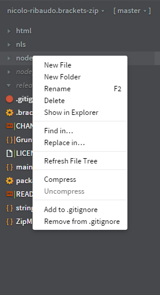

# THIS EXTENSION IS NO LONGER MANTAINED

I don't use [Adobe Brackets](https://github.com/adobe/brackets) anymore, so I'm not maintaining this extension. If you would like to maintain it, contact me at nicolo.ribaudo@gmail.com.

# Brackets Zip :floppy_disk:

Compress and uncompress files or folders in [Brackets](http://brackets.io).

Just click on `Compress` or on `Uncompress` - which is enabled only on `.zip` files.

## Some screenshots:

## [Change Log](CHANGELOG.md)

## Contribute

You can contribute in one of this three ways:

- ### File an issue
  If, using the extension, you find a bug, please [report it](https://github.com/nicolo-ribaudo/brackets-zip)!
  
- ### Fix a bug
  To fix a bug, follow these steps:
  1. If an issue about that bug is opened, ask if someone is already working on it.
  2. Clone the repo and run `npm install` to install dependencies.
  3. Code :wink:
  4. The code must pass jshint test.
  5. Submit a pull request and ... it will be merged!
  
- ### Translate
  To translate this extension, follow thes steps:
  1. Create a subfolder of the nls folder whose name is the language or locale you want to create a translation for.
     - If you're creating a general translation for a language, just use its two-letter code (e.g. `en`, `de`).
     - If you're creating a locale-specific translation for a particular country, add a hyphen and the country code in lowercase (e.g. `en-ca`, `en-gb`).
  2. Add an entry for your translation to the object in `nls/strings.js`.
  3. Copy the root `strings.js` file into your subfolder and start translating!
  
  You also can correct my English grammar errors :wink:

## License
[MIT](LICENSE)
